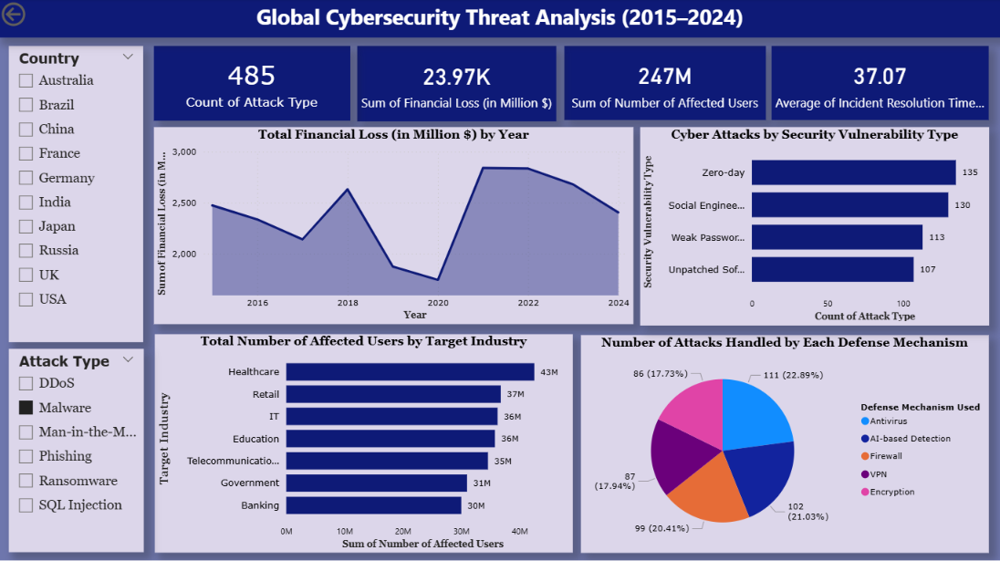

# Global Cybersecurity Threat Analysis Dashboard (2015–2024)

An interactive Power BI dashboard developed to analyze global cybersecurity threats, financial losses, affected users, and defense mechanisms across different countries and industries from 2015 to 2024.

---

## Project Overview

This project focuses on transforming cybersecurity threat data into meaningful insights through interactive visualizations and analytical reporting.

The dashboard helps identify:
- Cyber attack trends over time
- Financial impact caused by cyber threats
- Most vulnerable industries
- Common security vulnerabilities
- Effectiveness of defense mechanisms
- Country-wise cyber threat analysis

---

## Key Features

- KPI Cards for:
  - Total Attack Types
  - Total Financial Loss
  - Number of Affected Users
  - Average Incident Resolution Time

- Interactive Visualizations:
  - Financial Loss Trend by Year
  - Cyber Attacks by Security Vulnerability Type
  - Affected Users by Target Industry
  - Defense Mechanism Analysis
  - Country-wise Filtering
  - Attack Type Filtering

---

## Business Insights

- Identified years with highest financial losses caused by cyber attacks
- Analyzed industries most affected by cybersecurity threats
- Compared attack frequency across different vulnerability types
- Evaluated the usage of multiple defense mechanisms
- Visualized global cyber threat patterns using interactive reporting

---

## Tools & Technologies Used

- Microsoft Power BI
- Data Visualization
- Business Intelligence
- Dashboard Design
- KPI Reporting
- Data Analysis

---

## Dataset Information

The dataset used in this project was sourced from Kaggle and utilized for educational and portfolio development purposes.

---

## Dashboard Preview

---

## Project Files

This repository contains:
- Power BI Dashboard File (.pbix)
- Dataset Files
- Dashboard Screenshots
- README Documentation

---

## Learning Outcomes

Through this project, I improved my understanding of:
- Cybersecurity Data Analysis
- Interactive Dashboard Development
- Business Intelligence Reporting
- Data Storytelling
- KPI-Based Analytics
- Visual Analytics using Power BI

---

## Disclaimer

This dashboard was created for learning and portfolio purposes using a publicly available dataset from Kaggle. The insights shown are based on the dataset used and may not represent real-world cybersecurity statistics.

---

## Connect With Me

LinkedIn:
www.linkedin.com/in/sandhya-mourya-a92475286
